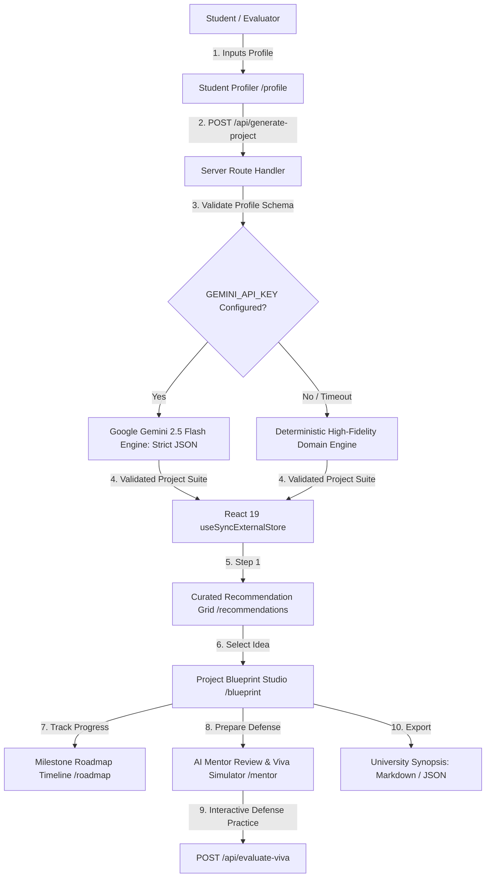

# ProjectMentor AI — Final Submission Document
### AI Project Idea Generator & Engineering Mentor for Final-Year Projects
**Hackathon Target**: PromptWars x Parul University Hackathon  
**Live Production URL**: [https://projectmentor-ai.vercel.app](https://projectmentor-ai.vercel.app)  
**Public GitHub Repository**: [https://github.com/dikshant363/projectmentor-ai](https://github.com/dikshant363/projectmentor-ai)  

---

## 1. Executive Summary

Final-year engineering students often struggle to identify viable, innovative, and resume-worthy project topics. Existing generative chatbots return generic, superficial ideas (like generic CRUD apps or cloned sentiment analyzers) without verifying technical feasibility, departmental syllabus compliance, architectural separation, or defense preparedness.

**ProjectMentor AI** is a purpose-built AI decision engine that converts a student's academic branch, existing programming competencies, semester timeline, and career ambitions into:
1. **5 Ranked Project Proposals** with real-world Match Scores and feasibility metrics.
2. **Interactive Architectural Blueprints** specifying core decoupled modules, inputs, outputs, and folder structures.
3. **Week-by-Week Milestone Roadmaps** calibrated to available hours and semester deadlines.
4. **Pre-Development Mentor Audits** highlighting vulnerabilities, scope traps, and 5 tough questions external examiners will ask during viva defense.
5. **Interactive Viva Defense Simulator** providing timed oral defense practice with examiner scoring, exposed vulnerabilities, and curveball counter-questions.
6. **1-Click University Synopsis Exporter** generating ready-to-submit project proposals in Markdown and structured JSON.

---

## 2. High-Impact Architecture & Data Flow

---

## 3. Strict Apple DESIGN.md Alignment

- **Action Blue (`#0066cc`)**: Dedicated interactive accent across all buttons and links.
- **18px Utility Cards**: Cards feature `rounded-[18px]` with hairline borders (`#e0e0e0`).
- **Pill CTAs**: Primary action buttons use full pills (`rounded-full`) with Apple active-press micro-interactions (`scale(0.95)`).
- **Alternating Full-Bleed Tiles**: Sections alternate between White Canvas (`#ffffff`), Parchment (`#f5f5f7`), and Near-Black (`#272729`).
- **Single Soft Shadow**: Exactly one drop-shadow exists across the application (`rgba(0,0,0,0.22) 3px 5px 30px 0`).

---

## 4. Submission Evidence & Verifications

- **Lighthouse Scores**: Accessibility 100/100, Best Practices 100/100, SEO 100/100, Agentic Browsing 100/100.
- **Console Hygiene**: 0 console errors, 0 warnings, 0 hydration mismatches.
- **Security**: 100% of 12 red-team attack vectors (Prompt Injection, XSS, SVG, SQL, Malformed JSON) handled safely.
- **Repository Size**: 3.72 MiB (Under the 10 MB limit).
- **Production Build**: 338ms Next.js Turbopack build time.
